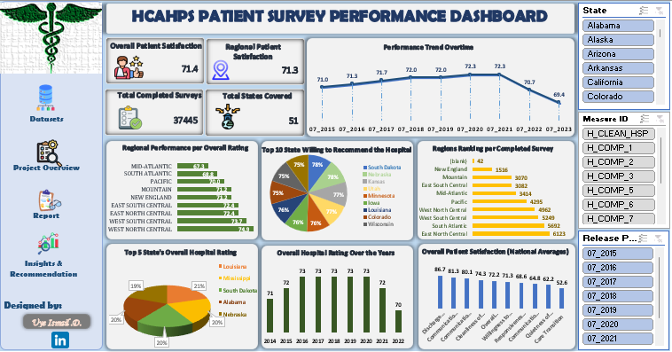

#  HCAHPS Patient Survey Analysis  

## 📌 Project Title  
**Hospital Consumer Assessment of Healthcare Providers and Systems (HCAHPS) Patient Survey (2013–2022)**  

---

## 📖 Project Overview  
This project analyzes U.S. **HCAHPS survey data (2013–2022)** to uncover patterns in patient satisfaction, communication, cleanliness, responsiveness, and discharge processes across hospitals. The dataset provides a nationwide view of patient perceptions, enabling insights into both strengths and gaps in healthcare delivery.  

The goal is to uncover **trends, disparities, and opportunities for improvement** in U.S. hospitals, empowering leaders to deliver **better patient-centered care**.  

> *"The good physician treats the disease; the great physician treats the patient who has the disease."* — William Osler 👨‍⚕️  

---

## 📝 Objectives  
- 📈 Track **patient satisfaction trends** (2013–2022).  
- 🌍 Compare **national vs. state-level** performance.  
- 🏥 Identify **strengths and weaknesses** in hospital services.  
- 🎯 Highlight **actionable areas for improvement**.  
- 🤝 Support **evidence-based healthcare decisions**.  

---

## 🛠 Tools & Technologies  
- 💻 **Microsoft Excel** – Dashboard design, visualization, and trend analysis.  
- 📑 **HCAHPS Patient Survey Dataset (2013–2022)** – Source: CMS (Centers for Medicare & Medicaid Services) / Maven Analytics.  

---

## 🧩 Skills Used  
- 📊 **Data Cleaning & Preparation**  
- 📈 **Trend & Time Series Analysis**  
- 📉 **Comparative Analysis (State vs. National)**  
- 🎨 **Dashboard Design & Visualization**  
- 📝 **Business Storytelling & Insights Reporting**  

---

## 🌐 Live Dashboard  
Experience the interactive dashboard live here:
[Click to view the live dashboard](https://1drv.ms/x/c/a145471cdb65b729/EbhlhZWW-qxCk3DUcUVByPgBrjC1TrjONvVzxp7xsZrDAA?e=aPG02C)

---

## 🎯 Purpose  
- Provide a **data-driven overview** of hospital performance across the U.S.  
- Identify **progress made** in patient satisfaction over 9 years.  
- Pinpoint **areas where hospitals need improvement**.  
- Guide **hospital leaders and policymakers** with actionable insights.  

---

## 🖼️ Dashboard Preview 

---

## ❓ Key Business Questions Answered  
- Have hospitals improved their **quality of care** over the past 9 years?  
- Which states or areas show the **most progress**?  
- What are the **major gaps** in patient satisfaction?  
- What recommendations can help hospitals improve **patient experiences**?  

---

## 🔑 Key Insights from KPIs  
- 🏥 **Total Records Analyzed:** 47,889 survey responses across states.  
- 📈 **National Satisfaction Trend:** Overall satisfaction improved slightly over 9 years, though unevenly across regions.  
- 🌎 **Top-Performing States:** Consistently strong in **patient communication** and **cleanliness**, offering best practices for others.  
- ⚠️ **Areas of Concern:**  
  - Nurse responsiveness = **lowest-rated measure nationwide**.  
  - Doctor communication = improving but inconsistent.  
  - Discharge information = persistent gap in many hospitals.  
- 📊 **Performance Gap:** Large disparities remain between high- and low-performing states.  
- 🔄 **Opportunities:** Hospitals that focused on **staff training and patient-centered policies** saw the most significant improvements.  

---

## 🔑 Key Insights  
- 📈 **National Trend**: Patient satisfaction improved modestly but inconsistently across states.  
- 🏆 **Top Performers**: Some states consistently scored higher, showcasing best practices.  
- ⚠️ **Weak Points**: Staff communication and responsiveness remain areas of concern.  
- 🌍 **Regional Disparities**: Significant gaps exist between states, revealing unequal access to quality care.  

---

## 📑 Detailed Report  
The interactive dashboard provides:  
- ⏳ **Trends Over Time** – Yearly shifts in patient satisfaction.  
- 🌎 **State Comparisons** – Ranking and benchmarking across states.  
- 🧾 **Measure Breakdown** – Communication, cleanliness, responsiveness, discharge processes.  
- 🇺🇸 **National Benchmarks** – Comparing state-level performance with U.S. averages.  

---
## 💡 Recommendations  
- 👩‍⚕️ **Improve Nurse Responsiveness:** Prioritize nurse-patient interaction training and adequate staffing.  
- 🧼 **Enhance Cleanliness:** Standardize cleaning protocols across underperforming facilities.  
- 🗣️ **Strengthen Communication:** Encourage doctors and nurses to use patient-friendly communication strategies.  
- 📋 **Discharge Process:** Simplify and standardize discharge instructions for clarity.  
- 🌎 **Reduce State Disparities:** Share best practices from top-performing states with underperforming ones.  
- 🏥 **Adopt Best Practices** – Share strategies from high-performing states.  
- ⏱ **Increase Overall Responsiveness** – Enhance staff availability and response times.  
- 📊 **Policy Alignment** – Standardize national programs to reduce state-level disparities.  

---

## 🚀 How to Use This Project  
1. 📂 **Download or Clone** this repository.  
2. 📊 **Open the Excel Dashboard** in **Microsoft Excel (2016 or later)**.  
3. 🔍 **Explore** trends across years, states, and measures.  
4. 📈 **Apply Insights** to strengthen hospital strategies and improve patient outcomes.  

---

## 🏁 Conclusion  
The **HCAHPS Patient Survey Analysis (2013–2022)** reveals steady but uneven improvements in U.S. hospital care. While some states excel, **critical gaps remain in staff communication, responsiveness, and equitable access**. Addressing these will help improve **overall patient satisfaction and healthcare quality nationwide**.  

---

## ✨ Quote  
*"The best way to find yourself is to lose yourself in the service of others."* – Mahatma Gandhi  

---

🔗 I encourage you to explore the dashboard, test different filters, and discover how data-driven decision-making can transform business strategies.  

---

## 👨‍💻 Author
**Ismail** – *Data Analyst | Healthcare Data Enthusiast*  

---

I’m passionate about turning raw datasets into meaningful insights 📊. With hands-on experience in **Excel**, **SQL**, and **Power BI**, I enjoy analyzing, visualizing, and storytelling with data to support smarter business decisions 🚀.  

---

🔗 **Let’s Connect**  
- 🌐 [LinkedIn](https://www.linkedin.com/in/uye-ismail-d)  
- 📧 uyedanzismuye@gmail.com 
- 📧 uyeismaildanzismuye@gmail.com   

---

## 🙏 Closing Note  
Thank you for taking the time to explore this project 💡.  
I hope the insights and recommendations spark new ideas and inspire smarter decisions.  

Feel free to ⭐ this repo if you found it useful, and don’t hesitate to explore my other projects for more data stories 📊✨.  

I’m always open to collaboration, feedback, and knowledge-sharing; let’s connect and build something impactful together! 🤝  
